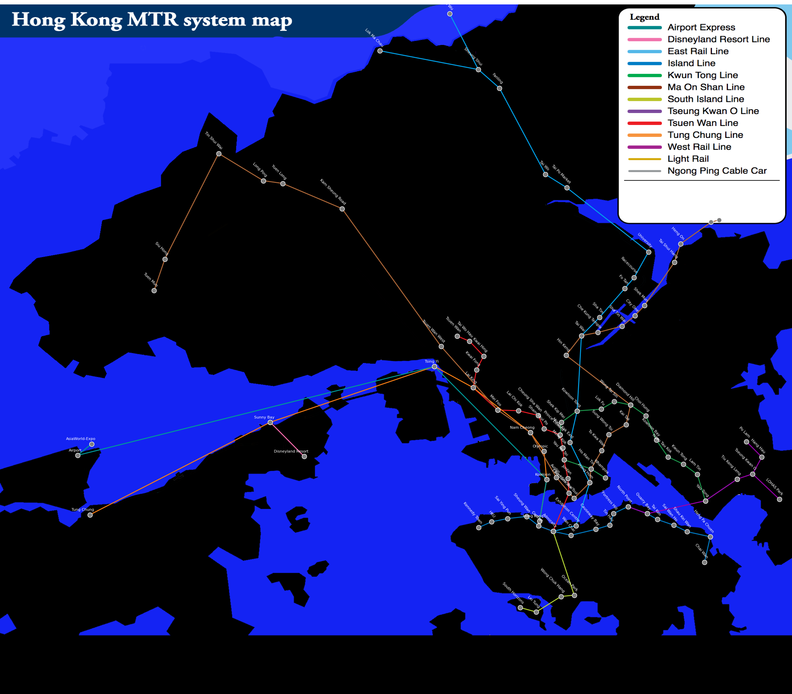

# MTR Hong Kong Info Mining

The main aspect of this project is about generating datasets out of public available web scrapped information about public transportation in Hong Kong.
At the same time it creates a map plot about the generated data with their real geographical coordinates(extracted through Google Cloud Geocoding API).


## Getting Started

### Prerequisites

Essential for the execution of the python files is an active Google Cloud Project(with Geocoding API enabled), while the executing user will need to have a API key with the correct rights.

### Running the datamine_hk_mtr_info

1. Run the script:
   ```bash
   python3 datamine_hk_mtr_info.py
   ```
2. inspect generated dataset
   ```bash
   cd media
   vi Stations_With_Coords_And_Maps.csv
   ```

### generate map picture of the datasets

1. Run the script:
   ```bash
   python3 display_mt_map.py
   ```
- After the execution is done, the image will be available in the media folder as hong_kong_mtr_map.png

<p align="center">
   
</p>

## Sources from Datamining

Line, Station names but also the web links to the pdf maps(of the individual station and the area surrounding it) where taken from the official website of the [Mass Transit Railway Corporation](https://www.mtr.com.hk/en/customer/services/system_map.html).
Geographical Coordinates where automatically querried through a Google Maps API by Geocoding / Google Cloud.
For the custom background image I modified a MTR system map version 2022 from [Wikipedia](https://en.m.wikipedia.org/wiki/File:Hong_Kong_Railway_Route_Map_en.svg) to my preferences.

## Possible Future Works

At the moment of creating this project it only uses MTR/Subway data from Hong Kong. I am thinking of also including graphs for the public buses and fairies. 

## License

This project is licensed under the MIT License - see the [LICENSE](LICENSE) file for details.
